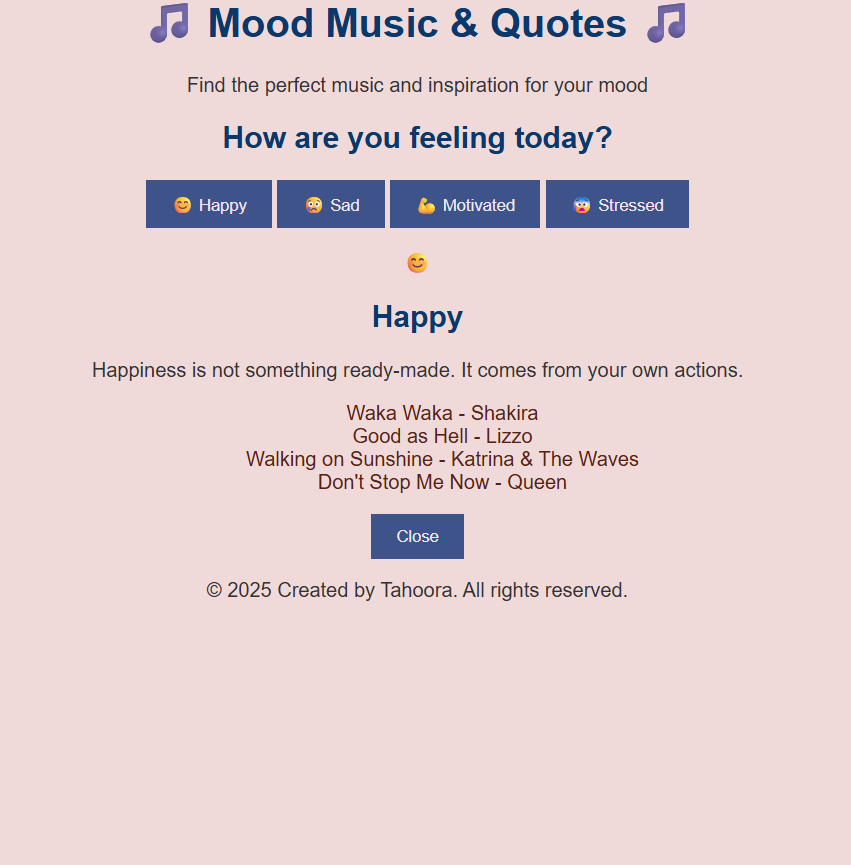

# 🎵 Mood Music Player

A simple **mood-based music player** built with HTML, CSS, and JavaScript.  
Choose your mood, and the app will display a matching emoji, motivational quote, a random mood-specific image, and curated YouTube tracks to fit the vibe.

---

## ✨ Features
- 🎭 Mood selection (Happy, Sad, Motivated, Stressed)
- 💬 Inspirational quotes for each mood
- 🎶 Curated YouTube music links
- ▶️ Play, Pause, and Next buttons (demo actions)

---

## 📸 Demo
  
---

## 🚀 Getting Started

### 1. Clone the repository
```bash
git clone https://github.com/Tahoora-Tabassum/mood-based-music-player.git
